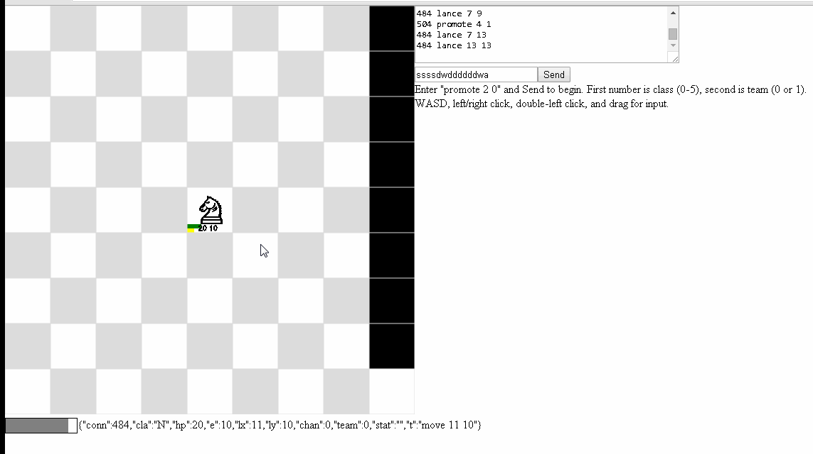

kchess
======

Chess-inspired MMO with tick-based, kill-the-king combat ([GUI/API docs](docs/kchessdoc.md)). Server uses kdb+/k/q web sockets, client is static JS/HTML/CSS. Client is meant to be heavily customized and networked AI/botting is encouraged (see AI directory for sample AI in kdb+).

[Live demo](https://srpeck.github.io/kchess/2dkchess.htm)

Dependencies
------------
- [kdb+/k/q](http://kx.com/software-download.php)

To run
------
1. Drop kchess.q in the q directory.

2. Start the kdb+/k/q web socket server:
	- Linux: /path/to/q/l32/q kchess.q -p 8080
	- Windows: /path/to/q/w32/q kchess.q -p 8080

3. Open 2dkchess.htm in a browser.
