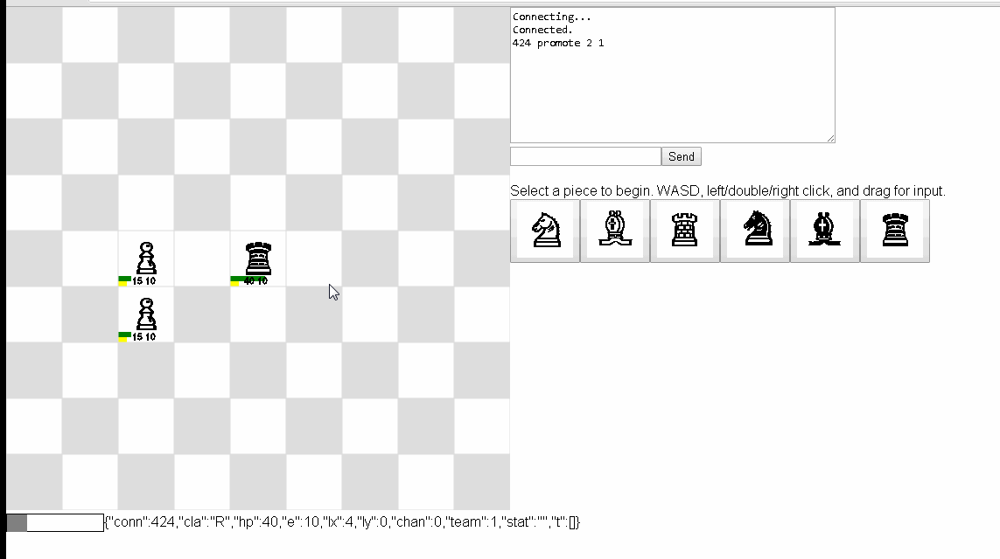
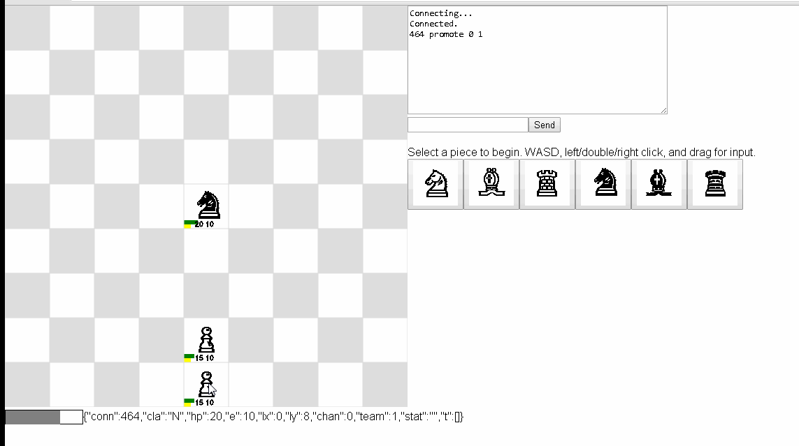
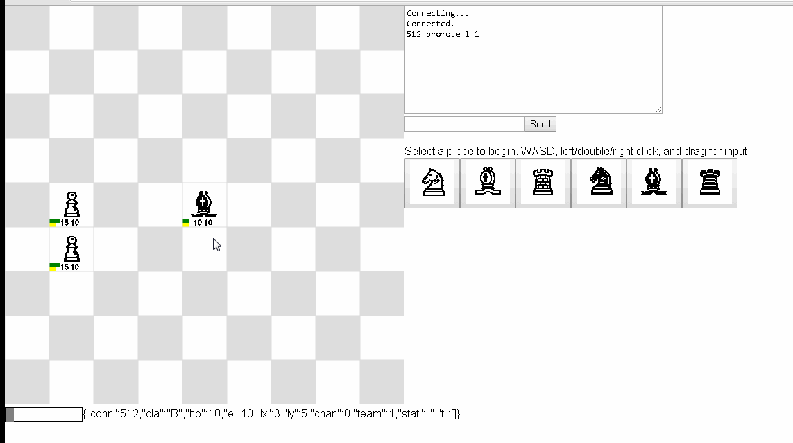
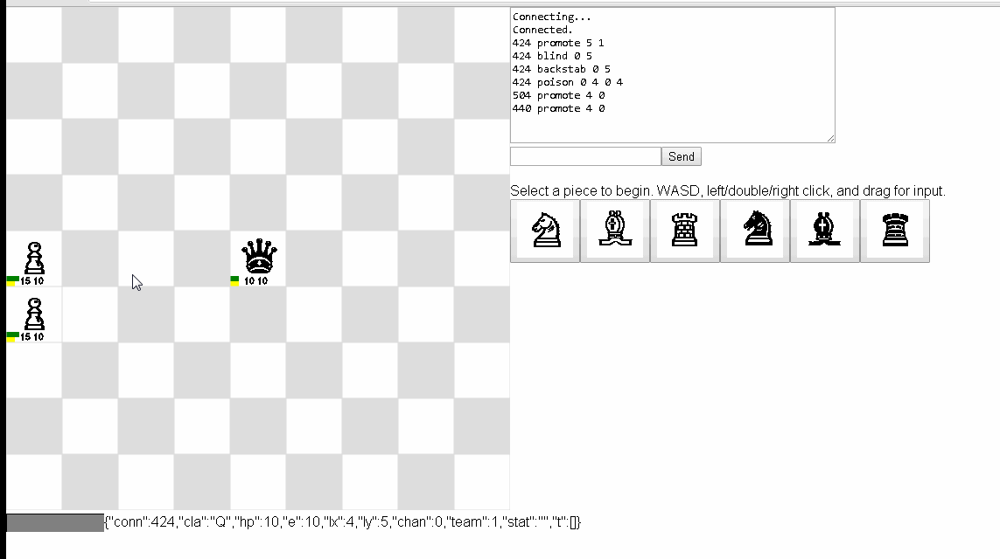
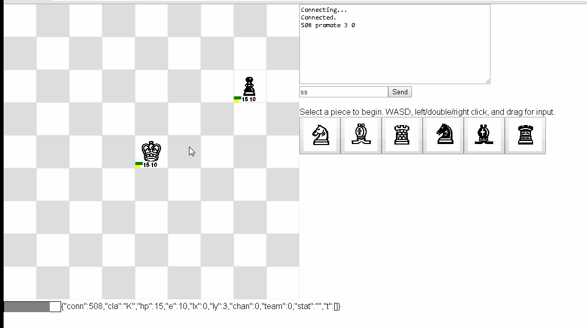

# kchess

The object of the game is to kill the enemy King, which has the side effect of killing everyone on his team. Killing a unit disconnects it from the game, requiring a reconnect and respawn.

- Server is on 1 second tick; tick timer shows time since last server update.

- Full friendly fire damage.

- All abilities are energy-based; all units have 10 energy and regenerate 0.5 per tick.

- Channeled abilities (Bishop's Meteor, Rook's Smash, King's Spawn and Wall) are fully interrupted by anything - damage, move, ability, retarget, etc.

    - Note: This server/client does not automatically channel abilities for you - you must continue to cast the ability targeting the same space until it is cast (2 or 3 ticks depending on the ability).

- Movement is normally N/S/E/W (WASD keys), though Bishop can Sidestep to diagonals; 1 unit per space/collision detection; either move or use ability per tick.


Primary roles:

  - Rook for objectives/confined-space/defense/infantry

  - Knight for skirmish/open-field/sallies/cavalry

  - Bishop for damage/offense/artillery

  - Queen for single target assassination

  - King for fortification

  - Pawn for fodder


2D Web GUI Client
-----------------

WASD keys - Basic N/S/E/W movement for all classes [```move 1 2```]

Rook (40hp): [```promote 2 0```]

  - WASD keys - Run Over (-0e) - All rook moves that collide with someone damage them (-10hp), including allies [```runover 2 3```]

  - Left click - Push (-3e) - Knocks back any adjacent unit (even Walls) including diagonals by 1 space; if a collision occurs, damages both the pushed unit and the unit in the way (-10hp each) [```push 1 1```]

  - Drag/drop - Grab and Throw (-3e) - Grabs any adjacent unit (even Walls) including diagonals and throw them at any adjacent space, including self; if a collision occurs, damages both the thrown unit and the unit in the way (-10hp each) [```grabthrow 4 4 5 5```]

  - Right click - Smash (-2e per tick, -4e total) - Channel for a tick, then damages all units in a cardinal direction (N/S/E/W) including diagonals (-30hp each) [```smash 4 4```]



Knight (20hp): [```promote 0 0```]

  - Double click or drag/drop - Sword (-2e) - Hit any single adjacent unit, including diagonals (-10hp) [```sword 1 2```]

  - Left click - Arrow (-3e) - Ranged attack of 4 - for diagonals, this means 2 spaces - hits the first unit in a line (-8hp) [```arrow 4 4```]

  - Right click - Lance Charge (-4e) - Minimum distance of 2, then damages all units in a line of 2 (-15hp) - for diagonals, this means 1 space moved [```lance 2 3```] 



Bishop (10hp): [```promote 1 0```]

  - QEZC keys - Sidestep (-1e) - Diagonal movement [```sidestep 1 2```]

  - F key - Meditate (+2e) - Regenerate 2 energy [```meditate 0 0```]

  - Left or right click - Meteor (-2e per tick, -6e total) - Channel for 2 ticks then damages a 3x3 square centered up to 4 distance away (-50hp each); the area will burn for AoE damage over time (-5hp per tick for 3 ticks, -15hp total) [```meteor 2 2```]



Queen (10hp): [```promote 5 0``` - 1 per team]

  - Double click or drag/drop - Poison (-4e) - Applies -5hp per tick for 3 ticks (-15hp total) to any adjacent target unit including diagonals [```poison 12 10```]
  
  - Left click - Blind (-3e) - Range of 4, target unit sees nothing for 3 ticks [```blind 10 9```]

  - Right click - Backstab (-5e) - Range of 1, hits any single unit (-50hp) [```backstab 2 3```]



King (15hp): [```promote 3 0``` - 1 per team]

  - Left click - Wall (-2e per tick, -4e total) - Channel for 2 ticks then create a Wall (50hp) blocking a space [```wall 1 2```]

  - Right click - Spawn Pawn (-3e per tick, -9e total) - Channel for 3 ticks then create a controllable Pawn unit [```spawn 2 3```]

  - Drag/drop - Command Pawn (-0e) - Grab any Pawn on the same team (even ones out of vision) and have them Attack Move an adjacent space (-5hp if any unit is in that space) [```cmdpawn 2 3```]



Pawn (15hp): [```promote 4 0```]

  - WASD keys, left or right click - Attack Move (-0e) - All pawn moves that collide with someone damage them (-5hp), including allies [```pawnattmove 1 1```]


Websocket API
-------------

On a new websocket connection, the server returns an integer connection handle for the newly created unit.

    440

Each 1 second tick, the server broadcasts JSON for every visible unit.

    {"conn":440,"cla":"P","hp":15,"e":10,"lx":-4,"ly":5,"chan":0,"team":0,"stat":"","t":[]}

To set the class of a newly spawned unit, clients send a message in the following form (classes are restricted to 0-5, teams are restricted to 0 or 1):

    promote <class> <team>

    promote 0 0

To perform most abilities, clients send messages to the server in the following form:

    <ability> <x> <y>

    move 5 5

For Rook's Grab and Throw or King's Command Pawn:

    <ability> <from x> <from y> <to x> <to y>

    grabthrow 5 5 4 4
